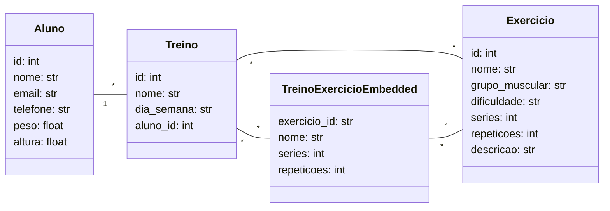

# :weight_lifting: FitGoal

Terceiro módulo do trabalho final da disciplina de Desenvolvimento de Software para Persistência (2024.2). A proposta da aplicação é a de ser uma plataforma para gerenciamento de treinos personalizados para alunos de uma academia ou de personal trainers, usando um banco de dados não relacional (MongoDB) para a persistência de dados. A aplicação permite o cadastro de alunos, criação de treinos, associação de exercícios aos treinos, e oferece consultas personalizadas sobre cada entidade.

## :wrench: Tecnologias Utilizadas:
- Linguagem de programação: Python 3.12

- Framework: FastAPI

- ODM: ODMantic (para integração com MongoDB)

- Banco de Dados: MongoDB

- Gerenciamento de dependências: python-dotenv

- Ferramenta de linting: ruff

## :page_facing_up: Diagrama de Classes UML:

